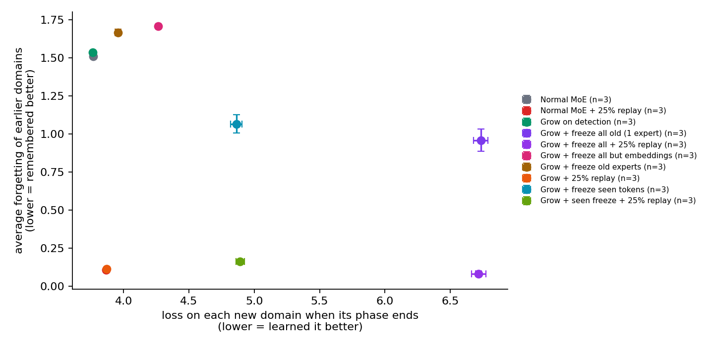
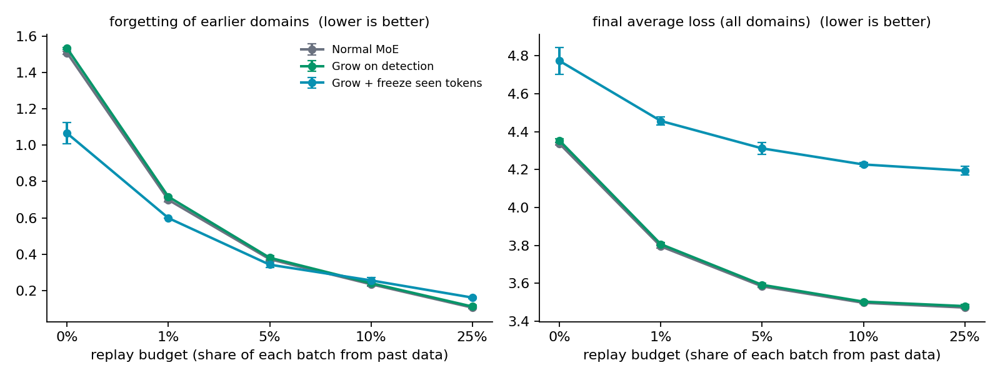

# Neuro-Genesis Engine

**Can a Mixture-of-Experts language model notice on its own that its training data has changed, grow new experts in response, and avoid forgetting what it already knew?**

This repository contains two things:

1. **The engine** — a Mixture-of-Experts layer whose expert count can grow *while the network is training*, plus a foundry that turns PyTorch source code (including code written by a local LLM) into validated, live experts. Originally built for the AMD Developer Hackathon ACT II.
2. **A study of whether that is useful** — about 160 training runs of continual pretraining on an AMD Radeon Pro W7900D, comparing growth against plain training, freezing strategies, and data replay, with 3–6 seeds per setting.

The short answer: **detecting the shift works; growing experts in response does not reduce forgetting, at any replay budget or at either model size we tested — while replaying even 1% of old data does.** The study also measures *why* growth fails and answers whether LLM-written experts beat randomly initialised ones (they don't).

## Results



*Each point is one method (mean ± std over 3 seeds). Down-left is better on both axes: remember the earlier domains, and still learn the new ones. Only replay reaches that corner.*

The setup: a small MoE language model is trained on three text domains in sequence — children's stories, then Python code, then math — and is **never told when the domain changes**. "Forgetting" is how much worse the model gets on an earlier domain by the end of training (in nats of cross-entropy).

| Finding | Evidence |
|---|---|
| **The model detects domain changes by itself.** A rolling z-score on its own training loss caught **132 of 132** boundaries across 66 runs, always 2 steps after the change, with **zero false alarms**. | [fig 3](results/figures/3_detection.png) |
| **It catches abrupt shifts down to about 10% of the data — but not gradual drift.** Switching 10%+ of the data to a new domain is always detected (within 2–10 steps); 5% is caught 1 time in 3; no change, never. Drifting *slowly* to 100% code is never detected, even though it raises the loss as much as a 25% switch that always is. | [fig 8](results/figures/8_detection_sensitivity.png), [fig 9](results/figures/9_gradual_drift.png) |
| **Growing experts on detection does not reduce forgetting.** Normal MoE: 1.51 forgetting. Growing at every detected change: 1.53. Growing at the *true* boundaries (oracle): 1.54. | [fig 1](results/figures/1_tradeoff.png) |
| **Why: two shared paths leak.** With every old weight frozen, the router still sends old-domain tokens to the new experts (32% → 68% as more experts are added; correlation with forgetting r = 0.80), and the token embeddings — shared by every domain, and tied to the output layer — drift. | [fig 4](results/figures/4_router_leak.png) |
| **Best method that stores no old data: freeze the embeddings of already-seen tokens.** −30% forgetting at 22M params, −44% at 101M — but always at a cost in learning the new domains. | [fig 6](results/figures/6_scale.png) |
| **Replay wins at every budget.** Mixing 1% old data into each batch halves forgetting; 5% removes 75–81%. Adding expert growth on top changes nothing, and adding freezing makes the final loss worse at every budget. | [fig 5](results/figures/5_replay_budget.png) |
| **The conclusions hold at 4.5× the model size** (22M → 101M parameters). | [fig 6](results/figures/6_scale.png) |
| **LLM-written experts are no better than random ones of the same size.** Gemma-2-2b-it designs vs size-matched random-init experts: no significant difference over 6 seeds (p = 0.27 forgetting, p = 0.30 final loss). Expert *size* does matter (p = 0.024 / 0.010). | [fig 7](results/figures/7_expert_source.png) |



Every number, table, and caveat is in **[`results/NOTES.md`](results/NOTES.md)** (16 findings), with all nine figures in [`results/figures/`](results/figures/).

## Setup

| | |
|---|---|
| **Data** | [TinyStories](https://huggingface.co/datasets/roneneldan/TinyStories) → [codeparrot-clean](https://huggingface.co/datasets/codeparrot/codeparrot-clean) (Python) → [open-web-math](https://huggingface.co/datasets/open-web-math/open-web-math); GPT-2 BPE tokens; 10M training tokens per domain (1220 steps of 32 × 256 tokens); a 1M-token held-out set per domain, split by document |
| **Model** | GPT-style decoder, every MLP replaced by an MoE layer: 4 layers, d_model 256, 4 experts of width 1024, top-2 noisy routing — **22.4M** params. Scale check: 8 layers, d_model 512, width 2048 — **101.5M** |
| **Methods** | normal MoE · more experts from the start · growth at the true boundaries (oracle) · growth on detection · five freezing strategies · task-free replay (a reservoir of past training windows, no domain labels) at 1/5/10/25% · Gemma-written vs random-init new experts |
| **Metrics** | held-out loss per domain at the end of each phase; **forgetting** = final loss on a domain − its loss at the end of its own phase; detection delay and false triggers |
| **Rigour** | 3 seeds per setting (6 for the closest comparison), mean ± std, Welch t-tests where it matters; bit-exact reproducibility verified across containers |
| **Hardware** | AMD Radeon Pro W7900D (48 GB) via AMD's cloud, ROCm PyTorch; ~4 min per 22M run, ~10 min per 101M run |

## Reproducing the experiments

```bash
git clone https://github.com/Jonathan-Jesni/neuro-genesis-engine.git
cd neuro-genesis-engine
pip install -e ".[experiments,test]"
```

**1. Data** (downloads and tokenizes ~30M tokens per domain; needs network, ~3 min):

```bash
python -m experiments.prepare_data
```

**2. One run** — one method, one seed. Configs live in [`configs/`](configs/); any setting can be overridden with `--set key=value`:

```bash
python -m experiments.train configs/toy_A.yaml --seed 0                                    # normal MoE
python -m experiments.train configs/toy_D.yaml --seed 0 --set confirm_steps=3             # growth on detection
python -m experiments.train configs/toy_A.yaml --seed 0 --set replay_frac=0.05 --name toy_A_r05   # + 5% replay
```

Each run writes `results/<name>_s<seed>/` with step logs, held-out evals, growth events and a `summary.json`.

**3. A whole batch** — each file in [`experiments/queues/`](experiments/queues/) is one session's experiment, one run per line. The runner is resumable (finished runs are skipped) and runs one job at a time:

```bash
bash experiments/run_queue.sh experiments/queues/day4.txt
```

| Queue | Finding in `results/NOTES.md` |
|---|---|
| configs `toy_A`–`toy_D`, `toy_*_fall`, `toy_*_fexp`, seeds 0–2 | 1–4 (detection, base methods, freezing) |
| `day3.txt`, `day3b.txt` | 4–6 (experts per boundary, router leak, embeddings) |
| `day4.txt` | 7–10 (seen-token freezing, 25% replay, reproducibility) |
| `day5.txt`, `day5b.txt` | 11 (replay budgets) |
| `day6.txt`, `day6b.txt`, `day7.txt` | 12–13 (101M scale check) |
| `day7b.txt`, `day7c.txt` | 14 (Gemma-written vs random experts) |
| `day8.txt` | 15 (detection sensitivity) |
| `day9.txt` | 16 (gradual drift) |

**4. Tables and figures:**

```bash
python -m experiments.summarize results           # mean ± std table over seeds
python -m experiments.analyze --fig tradeoff --arms toy_A toy_D toy_D_seen toy_A_replay
```

`python -m experiments.analyze --help` lists every figure. The Gemma-written expert designs are pre-generated and committed ([`experiments/generated_experts/d256.json`](experiments/generated_experts/d256.json)); regenerating them needs the gated Gemma weights (`python -m experiments.gen_experts`).

> **Cloud note.** On the AMD cloud notebook, running several training processes on the GPU at once crashed all of them (HIP illegal-memory-access errors); one process at a time never failed, which is why the queue runner is strictly sequential.

## The engine

The machinery the experiments are built on. It was originally a hackathon demo — a training loop that, when its loss spikes, has a local LLM (Gemma-2-2b-it) *write the PyTorch source code for a new expert*, validates it, and hot-swaps it into the live network mid-training, with full rollback on failure. The study above found that the LLM-written experts perform the same as random ones of the same size, but the engine itself is what makes growing a network mid-training possible at all.

Four components, each built on the one below:

- **[`DynamicNoisyTopKGate`](core/moe/dynamic_gating.py)** — a Shazeer-style noisy top-k router whose expert dimension can grow while the network trains. `expand(n)` swaps in new router matrices copy-on-write, is safe against concurrent forward passes, and preserves the routing of every existing expert exactly.
- **[`remap_optimizer_for_expansion`](core/moe/dynamic_gating.py)** — moves Adam's moment estimates onto the grown router tensors, so optimizer momentum isn't silently lost. Two-phase: validate and build everything first, then commit — a failure can never leave the optimizer half-changed. Called through `gate.expand(n, optimizer=opt)`.
- **[`ExpertFoundry`](core/moe/dynamic_gating.py)** — turns a string of PyTorch source into a live expert: AST screening, execution in a restricted namespace, a smoke-test forward pass, then transactional registration (optimizer group, expert, gate — rolled back completely on any failure).
- **[`TrainingOrchestrator`](core/orchestrator.py)** — the autonomous loop: a rolling z-score loss-spike detector, a pluggable expert generator (the real `GemmaExpertGenerator` or a dependency-free template), a self-correcting retry loop that feeds the exact rejection reason back to the LLM, checkpoint/resume that stores generated experts as source, and JSONL logging.

The experiments in [`experiments/`](experiments/) use the gate and foundry directly inside a small GPT ([`experiments/model.py`](experiments/model.py)). The `.agents/skills/*/SKILL.md` files are the usage contracts for the core components — read them before changing call sites.

### Demo: the self-expanding loop

CPU is fine; no GPU or Hugging Face account needed.

```bash
pip install -r requirements.txt
python -m core.orchestrator
```

A 300-step run on a synthetic regression task that injects an out-of-distribution batch every 40 steps. Each detected spike produces a validated new expert (4 → 11 experts with the seeded template generator) and the run writes `orchestrator_run.jsonl` plus a checkpoint every 25 steps; `python resume_demo.py` continues an interrupted run. With `transformers`/`accelerate` installed and an `HF_TOKEN` for the gated [google/gemma-2-2b-it](https://huggingface.co/google/gemma-2-2b-it), the demo uses the real LLM generator instead; otherwise it falls back to the template.

### Tests

```bash
pytest tests/ -v        # 63 passed, 1 skipped (the opt-in live Gemma test)
```

63 offline tests, no GPU or network needed. 44 cover the engine: gate concurrency, optimizer remapping, foundry validation and rollback, the orchestrator's retry and checkpoint logic, and the Gemma prompt/extraction code. 19 cover the experiment code on tiny synthetic data: every freezing mode, the replay buffer and fractional budgets, mixture and gradual-drift phases, growth with generated and size-matched experts, detector firing and silence, and bit-exact reproducibility. Every test file also runs standalone (`python tests/test_experiments.py`). The live test loads the real model: `NGEN_RUN_GEMMA_LIVE=1 pytest tests/test_gemma_generator.py`.

### AMD hardware and Docker

The engine was verified on an **AMD Radeon Pro W7900D via ROCm 7.2**: [`orchestrator_run_amd_hardware.jsonl`](orchestrator_run_amd_hardware.jsonl) is the unedited event log of a full self-expanding run on that GPU, and every experiment above ran on the same card.

The [`Dockerfile`](Dockerfile) builds on AMD's `rocm/pytorch` image, bakes the Gemma weights into the image so it runs fully offline, and refuses to build unless the full test suite and a live Gemma generation pass inside it. The Hugging Face token enters only as a BuildKit secret:

```bash
export HF_TOKEN=hf_...
docker build --secret id=hf_token,env=HF_TOKEN -t neuro-genesis:rocm-gemma .
docker run --rm --device=/dev/kfd --device=/dev/dri --group-add video --group-add render \
    --security-opt seccomp=unconfined neuro-genesis:rocm-gemma
```

### Visualizer

[`orchestrator_viz.html`](orchestrator_viz.html) is an animated playback of the AMD-hardware demo run — the expert network growing, the loss curve, and the spike → generate → validate → register pipeline. **Live: <https://neuro-genesis-engine.vercel.app/>**. Locally, open the file directly, or serve the repo root (`python -m http.server 8000`) so it loads the sibling log; any `orchestrator_run.jsonl` can be dragged onto the page.

## Limitations

**Of the study**

- **Small models, short training.** 22M and 101M parameters, trained from scratch on 30M tokens. The conclusions held across that 4.5× range, but we did not test pretrained models or billions of tokens, where the trade-offs could differ (seen-token freezing, for one, got relatively better with size).
- **Three domains, and a short-horizon detector.** Abrupt changes are caught down to about a 10% shift, but gradual drift is missed entirely: the detector compares against the last 50 steps, so a slow rise never looks like a spike. Catching drift needs a long-horizon reference, which we did not build.
- **One detector.** A loss z-score with a fixed threshold (z > 4 for 3 steps). Other signals (routing entropy, expert load) were logged but not compared.
- **The replay baseline has no learning-rate re-warming**, which published continual-pretraining recipes add; it already dominates without it.
- **Gemma's designs had little variety** (nearly all LayerNorm → 256→128 → 128→256), so "LLM-written vs random" was tested on a narrow range of designs.

**Of the engine**

- **The foundry sandbox prevents accidents; it is not a security boundary.** CPython `exec` cannot be made adversarially safe (e.g. `torch.save` is reachable). Untrusted code needs an external sandbox.
- **`torch.func.functional_call` is incompatible with the gate**, and the gate's `expand_lock` must be held across forward → backward → step and released before registration — the contracts in `.agents/skills/` spell this out.
- **Single device only** — no distributed or sharded expansion.

## Project structure

```
core/
  moe/dynamic_gating.py      DynamicNoisyTopKGate, remap_optimizer_for_expansion, ExpertFoundry
  orchestrator.py            TrainingOrchestrator, spike detector, Gemma generator, demo (__main__)
experiments/
  prepare_data.py            download + tokenize the three domains
  data.py                    sequential domain stream (incl. mixture phases), held-out sets
  model.py                   small MoE GPT with live expert growth
  train.py                   one run: growth, freezing, replay, expert sources, logging
  run_queue.sh               resumable sequential runner for a queue file
  queues/                    one file per experiment session (day3 ... day9)
  summarize.py, analyze.py   results table and figures
  gen_experts.py             pre-generate Gemma-written expert designs
  generated_experts/         the designs used in the generated-vs-random runs
configs/                     base configs for each method
results/
  NOTES.md                   every finding with full tables
  figures/                   the nine result figures
tests/                       63 offline tests + 1 opt-in live Gemma test
.agents/skills/              usage contracts for the gate, foundry and optimizer remap
demo.py, resume_demo.py      GPU smoke check; resume the orchestrator demo
orchestrator_viz.html        animated playback of the AMD-hardware demo run
Dockerfile                   ROCm container with Gemma baked in, build-gated by tests
```

## References

- N. Shazeer et al., [Outrageously Large Neural Networks: The Sparsely-Gated Mixture-of-Experts Layer](https://arxiv.org/abs/1701.06538) (2017) — the gating.
- W. Chen et al., [Lifelong Language Pretraining with Distribution-Specialized Experts](https://arxiv.org/abs/2305.12281) (2023) — growing experts at known distribution boundaries; the closest prior work.
- [Continual Pre-training of MoEs: How Robust Is Your Router?](https://arxiv.org/abs/2503.05029) (2025) — replay and router behaviour in continual MoE pretraining.
- Expert generation uses [google/gemma-2-2b-it](https://huggingface.co/google/gemma-2-2b-it) (gated; Google's Gemma license).

## License

[MIT](LICENSE). The engine was built for the AMD Developer Hackathon ACT II (Unicorn Track); the study was carried out afterwards as a semester project.
